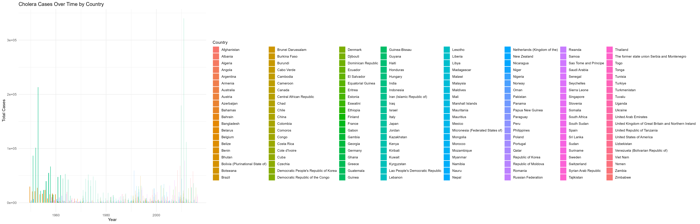
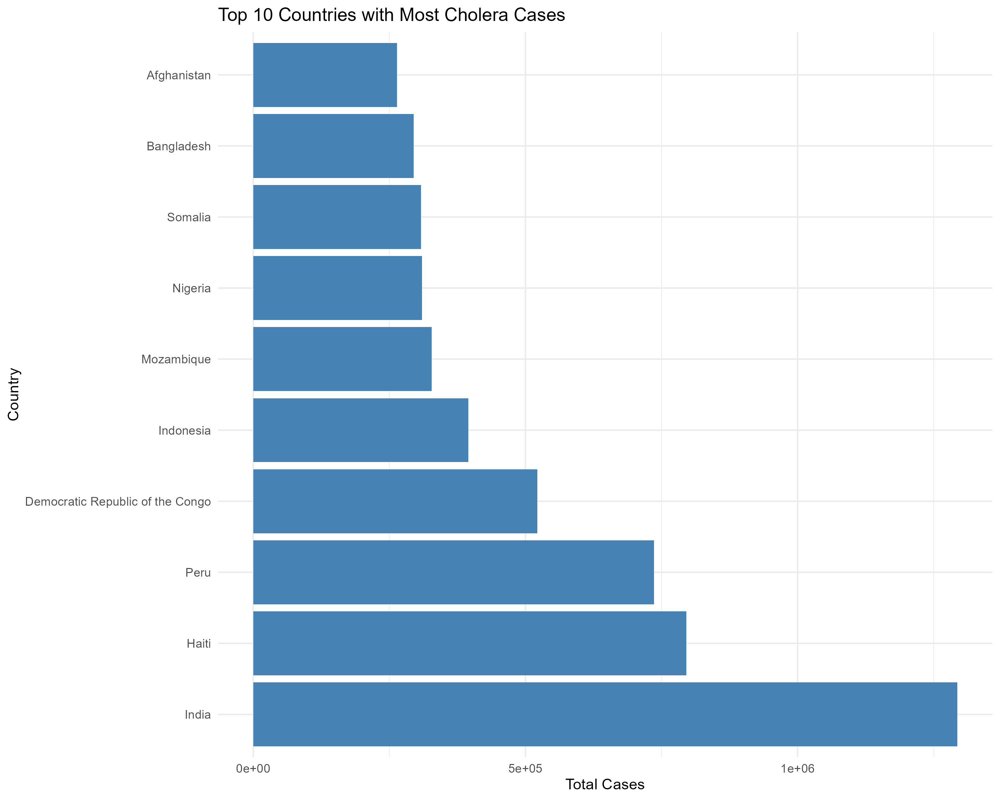
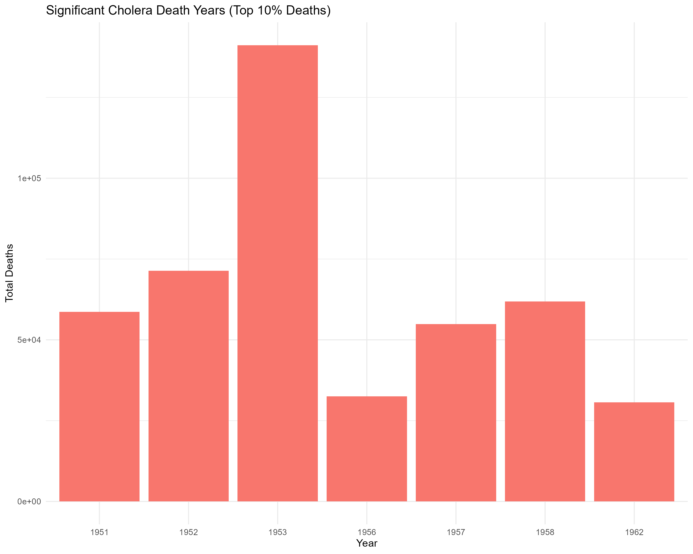
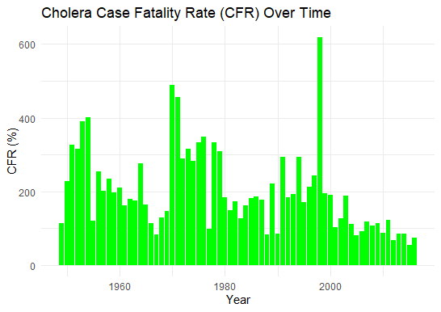
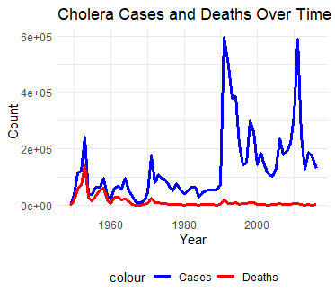

### **Global Cholera Cases and Deaths Over Time: A Summary**
Author: Mahesh Rani Kamilus

Cholera, a severe diarrheal disease caused by *Vibrio cholerae*, has
been a recurring global health challenge, affecting millions over time.
Analysis of cholera cases and deaths from various countries and time
periods highlights key trends and significant outbreaks across different
regions and decades.

India stands out as the country with the highest number of cholera cases
globally, accounting for over 1.29 million cases and 509,438 deaths.
Other countries with significant outbreaks include Haiti, Peru, the
Democratic Republic of the Congo, and Indonesia. Haiti, in particular,
experienced a massive cholera epidemic after the 2010 earthquake,
leading to 795,794 cases and 9,411 deaths. Countries like Mozambique,
Nigeria, Somalia, Bangladesh, and Afghanistan also reported substantial
case numbers, making them critical regions in the global cholera burden.

In terms of yearly trends, 1991 was a critical year for cholera,
recording 595,331 cases and 19,302 deaths. This period saw one of the
most significant global cholera outbreaks. Other major outbreak years
include 2011 (587,854 cases), 1992 (492,957 cases), and 1994 (385,403
cases). These spikes in cholera incidence were primarily driven by
large-scale epidemics across several countries, particularly in
developing regions with poor sanitation and limited access to clean
water.

One remarkable observation is the high fatality rate (CFR) in the early
years. In 1953, cholera claimed 141,173 lives from 240,927 reported
cases, resulting in a case fatality rate of 65.2%. The 1950s and early
1960s were marked by particularly high death rates, often exceeding 50%.

However, global efforts in disease management, improved healthcare
access, and advancements in sanitation have led to a steady decline in
cholera-related deaths from the 1960s onward. By the 1990s and 2000s,
the death toll started to reduce significantly, even though the number
of reported cases remained high in some years. For example, in 1998,
298,750 cases were reported, but the number of deaths was 10,832,
reflecting a much lower fatality rate.

In conclusion, while cholera remains a persistent global health threat,
especially in countries with poor sanitation infrastructure, there has
been a notable reduction in death rates over time. Global interventions
and improved health systems have helped to mitigate the impact of the
disease, though much work remains to be done to fully control it in
high-risk regions.
